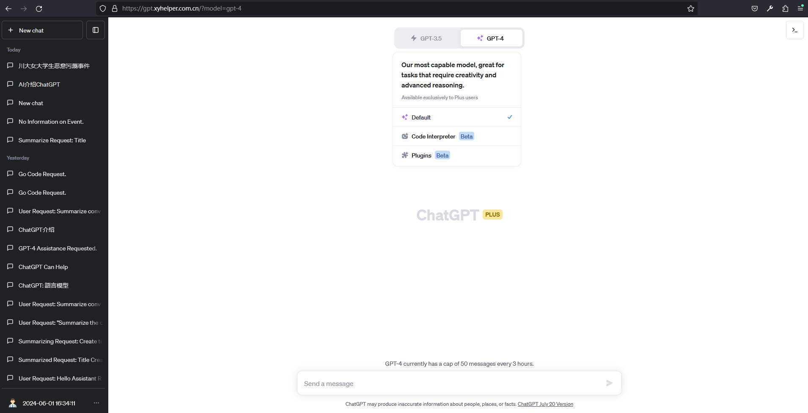
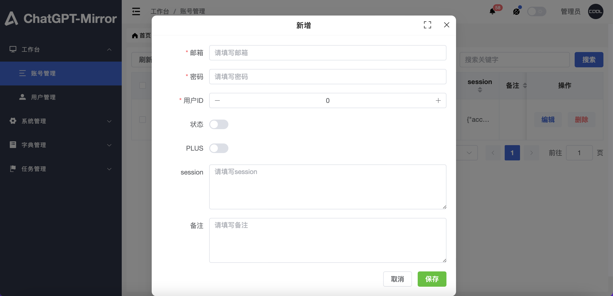
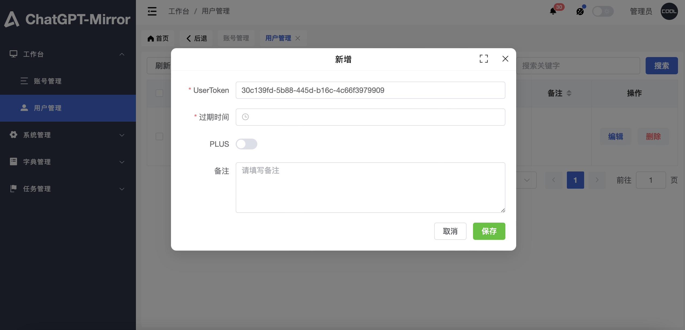

# ChatGPT-Group-Server-Deploy

本版本为`ChatGPT-Mirror-Server`的简化版本，限20官网账号，适合小规模团体使用。

`该服务为收费服务，不喜请绕行`

## 前置条件

- 一台至少 1 核 1G 内存的服务器,推荐使用香港、新加坡、日本地区的服务器,可以兼顾国内访问。
- 安装了 docker 和 docker-compose
- 安装了 git
- 有官网直登账号(不支持谷歌、微软、苹果等第三方登陆账号)


## 自动部署

在服务器上执行以下命令即可

```bash
curl -sSfL https://raw.githubusercontent.com/xyhelper/chatgpt-group-server-deploy/master/quick-install.sh | bash

```

## 手动部署

1. 克隆本仓库到服务器上

```bash
git clone --depth=1 https://github.com/xyhelper/chatgpt-group-server-deploy.git chatgpt-group
```

2. 进入目录

```bash
cd chatgpt-group
```

3. 启动服务

```bash
./deploy.sh
```

## 使用方法

访问服务器的 8001 端口即可使用

管理后台地址为 http://服务器 ip:8001/xyhelper/

默认用户名密码为 admin/123456

## 界面演示

### 用户界面



### 管理界面





## 加入交流群


